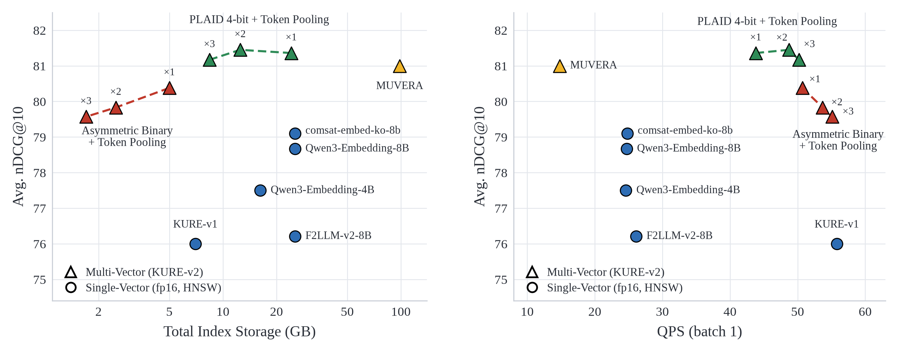
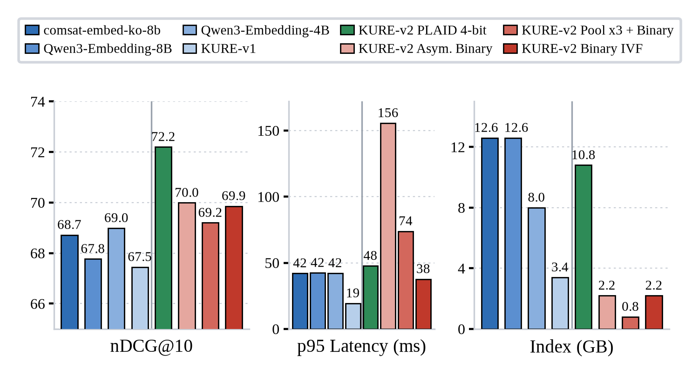

# 🔎 KURE: Korea University Retrieval Embedding models

[English](README.md) | [한국어](README_ko.md)

**KURE** is a family of Korean-English retrieval embedding models developed by the [NLP & AI Lab](http://nlp.korea.ac.kr/) and the [HIAI Institute](http://hiai.korea.ac.kr) at Korea University.

## Update Logs

- **2026.08.29**: [🤗 KURE-v2](https://huggingface.co/nlpai-lab/KURE-v2) released: a Korean-English bilingual **late-interaction (multi-vector)** model, state of the art on the MTEB(kor, v2) retrieval benchmark.
- 2024.12.21: [🤗 KURE-v1](https://huggingface.co/nlpai-lab/KURE-v1) released with the MTEB-ko-retrieval leaderboard.
- 2024.10.02: [🤗 KoE5](https://huggingface.co/nlpai-lab/KoE5) and [🤗 ko-triplet-v1.0](https://huggingface.co/datasets/nlpai-lab/ko-triplet-v1.0) released.

## Models

| Model | Type | Params | Base model |
|---|---|---|---|
| [KURE-v2](https://huggingface.co/nlpai-lab/KURE-v2) | Late-interaction (multi-vector) | 154M | [skt/A.X-Encoder-base](https://huggingface.co/skt/A.X-Encoder-base) |
| [KURE-v1](https://huggingface.co/nlpai-lab/KURE-v1) | Dense (single-vector) | 568M | [BAAI/bge-m3](https://huggingface.co/BAAI/bge-m3) |
| [KoE5](https://huggingface.co/nlpai-lab/KoE5) | Dense (single-vector) | 560M | [intfloat/multilingual-e5-large](https://huggingface.co/intfloat/multilingual-e5-large) |

KURE-v2 encodes every token into a 128-dimensional vector and scores query-document pairs with MaxSim, which preserves token-level semantics that single-vector models compress away. It supports documents up to 8,192 tokens and needs no instruction prefixes.

## Environment

We use [uv](https://docs.astral.sh/uv/) to manage the environment.

```bash
uv sync
```

## Usage

### KURE-v2 (late-interaction)

<details>
<summary><b>PyLate</b></summary>

```bash
uv add pylate
```

```python
from pylate import indexes, models, retrieve

model = models.ColBERT(model_name_or_path="nlpai-lab/KURE-v2")

index = indexes.PLAID(index_folder="pylate-index", index_name="index", override=True)

documents_ids = ["1", "2", "3"]
documents = [
    "세종대왕은 1443년에 훈민정음을 창제하고 1446년에 이를 반포하였다.",
    "김치는 배추나 무를 소금에 절인 뒤 고춧가루와 젓갈을 넣어 발효시킨 음식이다.",
    "한라산은 해발 1,947m로 남한에서 가장 높은 산이며 제주도 중앙에 자리한다.",
]

documents_embeddings = model.encode(documents, is_query=False)
index.add_documents(documents_ids=documents_ids, documents_embeddings=documents_embeddings)

retriever = retrieve.ColBERT(index=index)
queries_embeddings = model.encode(["훈민정음은 언제 만들어졌나요?"], is_query=True)
scores = retriever.retrieve(queries_embeddings=queries_embeddings, k=10)
```

</details>

<details>
<summary><b>Sentence-Transformers</b></summary>

```bash
uv add sentence-transformers
```

```python
from sentence_transformers import MultiVectorEncoder

model = MultiVectorEncoder("nlpai-lab/KURE-v2")

query = "훈민정음은 언제 만들어졌나요?"
documents = [
    "세종대왕은 1443년에 훈민정음을 창제하고 1446년에 이를 반포하였다.",
    "김치는 배추나 무를 소금에 절인 뒤 고춧가루와 젓갈을 넣어 발효시킨 음식이다.",
]

query_embeddings = model.encode_query(query)
document_embeddings = model.encode_document(documents)

# MaxSim late-interaction scoring (higher is more relevant)
scores = model.similarity(query_embeddings, document_embeddings)
```

</details>

### KURE-v1 / KoE5 (dense)

<details>
<summary><b>Sentence-Transformers</b></summary>

```python
from sentence_transformers import SentenceTransformer

model = SentenceTransformer("nlpai-lab/KURE-v1")
# model = SentenceTransformer("nlpai-lab/KoE5")  # needs "query: " / "passage: " prefixes

embeddings = model.encode(["첫 번째 문장", "두 번째 문장"])
similarities = model.similarity(embeddings, embeddings)
```

</details>

## Evaluation

We evaluate on the nine **MTEB(kor, v2) Retrieval** tasks with the latest [mteb](https://github.com/embeddings-benchmark/mteb) (v2.x), using the Korean subsets only (Belebele: `kor_Hang-kor_Hang`; MLDR is the mean of its dev/test splits):

- [Ko-StrategyQA](https://huggingface.co/datasets/taeminlee/Ko-StrategyQA): Korean ODQA multi-hop retrieval (translated StrategyQA)
- [AutoRAGRetrieval](https://huggingface.co/datasets/yjoonjang/markers_bm): document retrieval over parsed PDFs in finance, public sector, healthcare, law, and commerce
- [MIRACLRetrieval](https://huggingface.co/datasets/miracl/miracl): Wikipedia-based retrieval, ~1.5M documents
- [PublicHealthQA](https://huggingface.co/datasets/xhluca/publichealth-qa): medical / public-health domain retrieval
- [BelebeleRetrieval](https://huggingface.co/datasets/facebook/belebele): FLORES-200-based retrieval
- [MrTidyRetrieval](https://huggingface.co/datasets/mteb/mrtidy): Wikipedia-based retrieval, ~1.5M documents
- [MultiLongDocRetrieval](https://huggingface.co/datasets/Shitao/MLDR): long-document retrieval across domains
- [LawIRKo](https://huggingface.co/datasets/on-and-on/lawgov_ir-ko): Korean statute / case-law retrieval
- [SQuADKorV1Retrieval](https://huggingface.co/datasets/yjoonjang/squad_kor_v1): KorQuAD v1 passage retrieval

Late-interaction models are measured directly with mteb + PLAID retrieval; dense rows come from the official [MTEB results repository](https://github.com/embeddings-benchmark/results). To evaluate a model yourself, pass its name and paradigm:

```bash
uv run python eval/evaluate.py nlpai-lab/KURE-v2 multi-vector
uv run python eval/evaluate.py nlpai-lab/KURE-v1 single-vector
```

The per-task result files backing the leaderboard are in [`eval/results`](eval/results), and the table below is regenerated from them:

```bash
uv run python eval/make_leaderboard.py
```

### MTEB-ko-retrieval Leaderboard

Average over the nine tasks. Full per-task results are on the official [MTEB Leaderboard](https://mteb-leaderboard.hf.space/benchmark/MTEB(kor%2C%20v2)?types=Retrieval&s.summary=meanTask&d.summary=desc).

| Model | Type | Params | Avg nDCG@10 | Avg Recall@10 |
|---|---|---:|---:|---:|
| **[nlpai-lab/KURE-v2](https://huggingface.co/nlpai-lab/KURE-v2)** | Late-interaction | 154M | **0.8160** | **0.8921** |
| yjoonjang/colbert-ko-en-v2 | Late-interaction | 149M | 0.8063 | 0.8827 |
| sionic-ai/comsat-embed-ko-8b-preview | Dense | 7.6B | 0.7927 | 0.8876 |
| lightonai/mLateOn | Late-interaction | 307M | 0.7906 | 0.8740 |
| Qwen/Qwen3-Embedding-8B | Dense | 7.6B | 0.7826 | 0.8815 |
| Qwen/Qwen3-Embedding-4B | Dense | 4.0B | 0.7737 | 0.8753 |
| microsoft/harrier-oss-v1-27b | Dense | 27.0B | 0.7667 | 0.8624 |
| dragonkue/snowflake-arctic-embed-l-v2.0-ko | Dense | 568M | 0.7653 | 0.8609 |
| codefuse-ai/F2LLM-v2-8B | Dense | 7.6B | 0.7638 | 0.8593 |
| telepix/PIXIE-Rune-v1.5 | Dense | 568M | 0.7618 | 0.8596 |
| **[nlpai-lab/KURE-v1](https://huggingface.co/nlpai-lab/KURE-v1)** | Dense | 568M | 0.7616 | 0.8629 |
| dragonkue/BGE-m3-ko | Dense | 568M | 0.7547 | 0.8513 |
| BAAI/bge-m3 | Dense | 568M | 0.7509 | 0.8588 |
| perplexity-ai/pplx-embed-v1-late-0.6b | Late-interaction | 596M | 0.7381 | 0.8328 |
| **[nlpai-lab/KoE5](https://huggingface.co/nlpai-lab/KoE5)** | Dense | 560M | 0.7337 | 0.8300 |
| **[nlpai-lab/KURE-v2-unsupervised](https://huggingface.co/nlpai-lab/KURE-v2-unsupervised)** | Late-interaction | 154M | 0.7283 | 0.8268 |
| dragonkue/colbert-ko-0.1b | Late-interaction | 149M | 0.6776 | 0.7723 |
| yjoonjang/colbert-ko-v1 | Late-interaction | 149M | 0.6282 | 0.7212 |

## Training Details

### KURE-v2

The full two-stage training code is in [`train/late-interaction`](train/late-interaction).

- Built on [skt/A.X-Encoder-base](https://huggingface.co/skt/A.X-Encoder-base) with a multi-layer projection head (128-d per token, MaxSim scoring); trained with [PyLate](https://github.com/lightonai/pylate).
- **Stage 1 (PFT)**: large in-batch contrastive learning on 20.7M weakly related Korean/English pairs, released as [KURE-v2-unsupervised](https://huggingface.co/nlpai-lab/KURE-v2-unsupervised).
- **Stage 2 (SFT)**: contrastive learning + KL distillation from a reranker teacher on 3.03M triplets with hard negatives and false-negative filtering.

### KURE-v1

Training code in [`train/dense`](train/dense).

- Fine-tuned from [BAAI/bge-m3](https://huggingface.co/BAAI/bge-m3) on ~2M Korean query-document-hard-negative(5) pairs.
- CachedGISTEmbedLoss, batch size 4,096, lr 2e-5, 1 epoch.

### KoE5

- Fine-tuned from [intfloat/multilingual-e5-large](https://huggingface.co/intfloat/multilingual-e5-large) on [ko-triplet-v1.0](https://huggingface.co/datasets/nlpai-lab/ko-triplet-v1.0) (~700K+ examples).
- CachedMultipleNegativesRankingLoss, batch size 512, lr 1e-5, 1 epoch. Requires `query: ` / `passage: ` prefixes.

## Serving

KURE-v2 is a late-interaction model: each document is stored as a set of token vectors, so the practical questions for deployment are index size and search cost. We benchmarked KURE-v2 across ANN backends and compression schemes on the 9 Korean MTEB retrieval tasks, against five single-vector baselines served with [faiss HNSW](https://faiss.ai/cpp_api/struct/structfaiss_1_1IndexHNSW.html). All numbers are end-to-end: batch-1 query encoding + index search, measured serially on one A100 80GB. Runnable versions of these configurations are in [`deploy/late-interaction`](deploy/late-interaction) (`uv run deploy/late-interaction/run.py --index plaid`).

<p align="center">
  
</p>

Two things the figures show:

- Hierarchical token pooling (x2) halves the index for a 0.04 nDCG drop. Asymmetric binary quantization (1-bit document tokens, bf16 queries) shrinks it 9.4x for 1.05. Stacking the two (pooling x3 + binary), the entire 9-corpus index fits in **1.7 GB, smaller than every single-vector HNSW index (13.1-50.0 GB)**, while still outscoring the best single-vector model (79.57 vs 79.07).
- A live query arrives as text: 4B-8B single-vector models spend 38-40 ms encoding it, capping them at ~25 QPS no matter how fast HNSW is. KURE-v2 encodes in 13.8 ms (154M params), so every configuration except MUVERA serves **43-55 QPS, roughly 2x the 8B single-vector models, at higher quality**.

### Large corpora: tail latency

<p align="center">
  
</p>

On the largest corpus (MIRACL, ~1.5M documents) an exhaustive 1-bit scan costs O(corpus): p95 climbs to 156 ms, and pooling the tokens 3x only brings it to 74 ms. Generating candidates with faiss [BinaryIVF](https://faiss.ai/cpp_api/struct/structfaiss_1_1IndexBinaryIVF.html) (Hamming search over the same 1-bit index) and re-scoring them with exact asymmetric MaxSim cuts p95 to **38 ms on the same 2.2 GB index, lower tail latency than the 4B-8B single-vector baselines (43 ms) at higher nDCG**. For large collections, use a candidate-generating index (PLAID or BinaryIVF), not an exhaustive scan.

<details>
<summary><b>Measurement details</b></summary>

- **Hardware**: 1x NVIDIA A100 80GB, 2x AMD EPYC 7513 (64 cores), 1.2 TB RAM.
- **Software**: faiss-cpu 1.15.0, fast-plaid 1.6.0, sentence-transformers 6.0.0, PyTorch 2.8.0.
- **Protocol**: batch-1, serial. Index-search latency: 10 warmup queries, then every query of the task measured once (QPS = 1/mean). Query-encoding latency: 5 warmup, 50 measured. End-to-end = encoding + search.
- **Precision**: encoding in bf16; each index stores its own format (HNSW fp32, PLAID 4-bit residuals, binary 1-bit).
- **Index size**: the full serialized index on disk (vectors, graph, codebooks; external doc-id mapping excluded).
- **Tasks**: the 9 Korean MTEB retrieval tasks; MLDR is the mean of its dev/test splits; nDCG@10 x100.
- **HNSW**: `IndexHNSWFlat` (inner product on L2-normalized embeddings), M=32, efConstruction=200, efSearch=64.
- **PLAID**: nbits=4, all other settings fast-plaid defaults (kmeans_niters=4, n_ivf_probe=8, n_full_scores=4096). nbits=2/1 give 27.0/17.0 GB at 81.25/81.09 nDCG.
- **MUVERA**: num_repetitions=10, num_simhash_projections=6, final_projection_dimension=8192, exact-MaxSim rerank of the top 1,000.
- **BinaryIVF**: nlist=floor(sqrt(total tokens)) capped at 65,536, nprobe=32, top-128 Hamming tokens per query token, exact asymmetric-MaxSim rerank of the top 1,000 documents.
- **Token pooling**: hierarchical (Ward linkage), pool_factor 2-3, documents only.
</details>

## License

```MIT```

## Citation

If you find our models helpful, please consider citing:

```bibtex
@misc{kure-v2,
  title  = {KURE-v2: a Korean-English bilingual late-interaction retriever},
  author = {Youngjoon Jang, Junyoung Son, Taemin Lee, Seongtae Hong, Chanjun Park, Heuiseok Lim},
  year   = {2026},
  url    = {https://huggingface.co/nlpai-lab/KURE-v2},
}
```

```bibtex
@inproceedings{jang2025kure,
  title={KURE: Embedding Model for Korean-Specific Retrieval},
  author={Jang, Youngjoon and Son, Junyoung and Lee, Taemin and Hong, Seongtae and Park, JeongBae and Lim, Heuiseok},
  booktitle={Annual Conference on Human and Language Technology},
  pages={129--134},
  year={2025},
  organization={Human and Language Technology}
}
```

```bibtex
@inproceedings{jang2024koe5,
  title={KoE5: A New Dataset and Model for Improving Korean Embedding Performance},
  author={Jang, Youngjoon and Son, Junyoung and Park, Chanjun and Choi, Soonwoo and Lee, Byeonggoo and Lee, Taemin and Lim, Heuiseok},
  booktitle={Annual Conference on Human and Language Technology},
  pages={239--244},
  year={2024},
  organization={Human and Language Technology}
}
```
