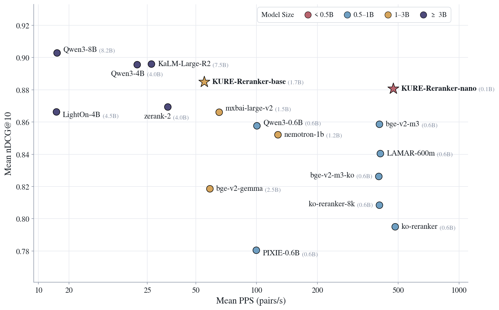

# 🔎 KURE: Korea University Retrieval Embedding models

<p align="center" width="100%">

</p>

[English](README.md) | [한국어](README_ko.md)

**KURE**는 고려대학교 [NLP & AI 연구실](http://nlp.korea.ac.kr/)과 [HIAI 연구소](http://hiai.korea.ac.kr)가 개발한 한국어-영어 검색 임베딩 모델 시리즈입니다.

## Update Logs

- 2026.10.01: [🤗 KURE-Reranker-base](https://huggingface.co/nlpai-lab/KURE-Reranker-base), [🤗 KURE-Reranker-nano](https://huggingface.co/nlpai-lab/KURE-Reranker-nano) 공개.
- 2026.08.29: [🤗 KURE-v2](https://huggingface.co/nlpai-lab/KURE-v2) 공개.
- 2024.12.21: [🤗 KURE-v1](https://huggingface.co/nlpai-lab/KURE-v1), MTEB-ko-retrieval 리더보드 공개
- 2024.10.02: [🤗 KoE5](https://huggingface.co/nlpai-lab/KoE5), [🤗 ko-triplet-v1.0](https://huggingface.co/datasets/nlpai-lab/ko-triplet-v1.0) 공개

## Models

| Model | Type | Params | Base model |
|---|---|---|---|
| [KURE-Reranker-base](https://huggingface.co/nlpai-lab/KURE-Reranker-base) | Reranker (cross-encoder) | 1.7B | [Qwen/Qwen3-1.7B](https://huggingface.co/Qwen/Qwen3-1.7B) |
| [KURE-Reranker-nano](https://huggingface.co/nlpai-lab/KURE-Reranker-nano) | Reranker (cross-encoder) | 149M | [skt/A.X-Encoder-base](https://huggingface.co/skt/A.X-Encoder-base) |
| [KURE-v2](https://huggingface.co/nlpai-lab/KURE-v2) | Late-interaction (multi-vector) | 154M | [skt/A.X-Encoder-base](https://huggingface.co/skt/A.X-Encoder-base) |
| [KURE-v1](https://huggingface.co/nlpai-lab/KURE-v1) | Dense (single-vector) | 568M | [BAAI/bge-m3](https://huggingface.co/BAAI/bge-m3) |
| [KoE5](https://huggingface.co/nlpai-lab/KoE5) | Dense (single-vector) | 560M | [intfloat/multilingual-e5-large](https://huggingface.co/intfloat/multilingual-e5-large) |

## Environment

[uv](https://docs.astral.sh/uv/)로 환경을 구성합니다.

```bash
uv sync                                                # dense, sparse, cross-encoder 모델
uv sync --extra late-interaction --no-default-groups   # KURE-v2 (PyLate)
```

PyLate는 `sentence-transformers==5.3.0`을 고정하지만 KURE-Reranker는 `>=5.6.1`이 필요하므로, late-interaction 환경은 별도로 구성합니다.

## Usage

### KURE-Reranker

<details>
<summary><b>Sentence-Transformers</b></summary>

```python
from sentence_transformers import CrossEncoder

model = CrossEncoder("nlpai-lab/KURE-Reranker-nano", max_length=8192)
# model = CrossEncoder("nlpai-lab/KURE-Reranker-base", max_length=8192)

query = "훈민정음은 언제 만들어졌나요?"
documents = [
    "세종대왕은 1443년에 훈민정음을 창제하고 1446년에 이를 반포하였다.",
    "김치는 배추나 무를 소금에 절인 뒤 고춧가루와 젓갈을 넣어 발효시킨 음식이다.",
    "한라산은 해발 1,947m로 남한에서 가장 높은 산이며 제주도 중앙에 자리한다.",
]

# 점수가 높을수록 관련성 높음
results = model.rank(query, documents, return_documents=True)
```

</details>

### KURE-v2

<details>
<summary><b>PyLate</b></summary>

```bash
uv add pylate
```

```python
from pylate import indexes, models, retrieve

model = models.ColBERT(model_name_or_path="nlpai-lab/KURE-v2")

index = indexes.PLAID(index_folder="pylate-index", index_name="index", override=True)

documents_ids = ["1", "2", "3"]
documents = [
    "세종대왕은 1443년에 훈민정음을 창제하고 1446년에 이를 반포하였다.",
    "김치는 배추나 무를 소금에 절인 뒤 고춧가루와 젓갈을 넣어 발효시킨 음식이다.",
    "한라산은 해발 1,947m로 남한에서 가장 높은 산이며 제주도 중앙에 자리한다.",
]

documents_embeddings = model.encode(documents, is_query=False)
index.add_documents(documents_ids=documents_ids, documents_embeddings=documents_embeddings)

retriever = retrieve.ColBERT(index=index)
queries_embeddings = model.encode(["훈민정음은 언제 만들어졌나요?"], is_query=True)
scores = retriever.retrieve(queries_embeddings=queries_embeddings, k=10)
```

</details>

<details>
<summary><b>Sentence-Transformers</b></summary>

```bash
uv add sentence-transformers
```

```python
from sentence_transformers import MultiVectorEncoder

model = MultiVectorEncoder("nlpai-lab/KURE-v2")

query = "훈민정음은 언제 만들어졌나요?"
documents = [
    "세종대왕은 1443년에 훈민정음을 창제하고 1446년에 이를 반포하였다.",
    "김치는 배추나 무를 소금에 절인 뒤 고춧가루와 젓갈을 넣어 발효시킨 음식이다.",
]

query_embeddings = model.encode_query(query)
document_embeddings = model.encode_document(documents)

# MaxSim 후기 상호작용 점수 (높을수록 관련성 높음)
scores = model.similarity(query_embeddings, document_embeddings)
```

</details>

### KURE-v1 / KoE5

<details>
<summary><b>Sentence-Transformers</b></summary>

```python
from sentence_transformers import SentenceTransformer

model = SentenceTransformer("nlpai-lab/KURE-v1")
# model = SentenceTransformer("nlpai-lab/KoE5")  # "query: " / "passage: " prefix 필요

embeddings = model.encode(["첫 번째 문장", "두 번째 문장"])
similarities = model.similarity(embeddings, embeddings)
```

</details>

## Evaluation

최신 [mteb](https://github.com/embeddings-benchmark/mteb)(v2.x)로 **MTEB(kor, v2) Retrieval** 9개 태스크를 평가하며, 한국어 subset만 사용합니다 (Belebele: `kor_Hang-kor_Hang`; MLDR은 dev/test 평균):

- [Ko-StrategyQA](https://huggingface.co/datasets/taeminlee/Ko-StrategyQA): 한국어 ODQA multi-hop 검색 (StrategyQA 번역)
- [AutoRAGRetrieval](https://huggingface.co/datasets/yjoonjang/markers_bm): 금융·공공·의료·법률·커머스 분야 PDF 파싱 문서 검색
- [MIRACLRetrieval](https://huggingface.co/datasets/miracl/miracl): Wikipedia 기반 검색, 약 150만 문서
- [PublicHealthQA](https://huggingface.co/datasets/xhluca/publichealth-qa): 의료·공중보건 도메인 검색
- [BelebeleRetrieval](https://huggingface.co/datasets/facebook/belebele): FLORES-200 기반 검색
- [MrTidyRetrieval](https://huggingface.co/datasets/mteb/mrtidy): Wikipedia 기반 검색, 약 150만 문서
- [MultiLongDocRetrieval](https://huggingface.co/datasets/Shitao/MLDR): 다양한 도메인의 장문 검색
- [LawIRKo](https://huggingface.co/datasets/on-and-on/lawgov_ir-ko): 한국어 법령·판례 검색
- [SQuADKorV1Retrieval](https://huggingface.co/datasets/yjoonjang/squad_kor_v1): KorQuAD v1 문단 검색

후기 상호작용 모델은 mteb + PLAID 검색으로 직접 측정하고, 밀집 모델 행은 공식 [MTEB results 저장소](https://github.com/embeddings-benchmark/results)의 점수를 사용합니다. 직접 평가하려면 모델명과 paradigm을 넘기면 됩니다:

```bash
uv run --extra late-interaction --no-default-groups python eval/dense/evaluate.py nlpai-lab/KURE-v2 multi-vector
uv run python eval/dense/evaluate.py nlpai-lab/KURE-v1 single-vector
```

리더보드를 뒷받침하는 태스크별 결과 파일은 [`eval/dense/results`](eval/dense/results)에 있으며(출처는 해당 폴더에 문서화), 아래 표는 그 파일들로부터 재생성됩니다:

```bash
uv run python eval/dense/make_leaderboard.py
```

### MTEB-ko-retrieval Leaderboard

9개 태스크 평균입니다. 태스크별 상세 결과는 공식 [MTEB 리더보드](https://mteb-leaderboard.hf.space/benchmark/MTEB(kor%2C%20v2)?types=Retrieval&s.summary=meanTask&d.summary=desc)에서 확인할 수 있습니다.

| Model | Type | Params | Avg nDCG@10 | Avg Recall@10 |
|---|---|---:|---:|---:|
| **[nlpai-lab/KURE-v2](https://huggingface.co/nlpai-lab/KURE-v2)** | Late-interaction | 154M | **0.8160** | **0.8921** |
| yjoonjang/colbert-ko-en-v2 | Late-interaction | 149M | 0.8063 | 0.8827 |
| sionic-ai/comsat-embed-ko-8b-preview | Dense | 7.6B | 0.7927 | 0.8876 |
| lightonai/mLateOn | Late-interaction | 307M | 0.7906 | 0.8740 |
| Qwen/Qwen3-Embedding-8B | Dense | 7.6B | 0.7826 | 0.8815 |
| Qwen/Qwen3-Embedding-4B | Dense | 4.0B | 0.7737 | 0.8753 |
| microsoft/harrier-oss-v1-27b | Dense | 27.0B | 0.7667 | 0.8624 |
| dragonkue/snowflake-arctic-embed-l-v2.0-ko | Dense | 568M | 0.7653 | 0.8609 |
| codefuse-ai/F2LLM-v2-8B | Dense | 7.6B | 0.7638 | 0.8593 |
| telepix/PIXIE-Rune-v1.5 | Dense | 568M | 0.7618 | 0.8596 |
| **[nlpai-lab/KURE-v1](https://huggingface.co/nlpai-lab/KURE-v1)** | Dense | 568M | 0.7616 | 0.8629 |
| dragonkue/BGE-m3-ko | Dense | 568M | 0.7547 | 0.8513 |
| BAAI/bge-m3 | Dense | 568M | 0.7509 | 0.8588 |
| perplexity-ai/pplx-embed-v1-late-0.6b | Late-interaction | 596M | 0.7381 | 0.8328 |
| **[nlpai-lab/KoE5](https://huggingface.co/nlpai-lab/KoE5)** | Dense | 560M | 0.7337 | 0.8300 |
| **[nlpai-lab/KURE-v2-unsupervised](https://huggingface.co/nlpai-lab/KURE-v2-unsupervised)** | Late-interaction | 154M | 0.7283 | 0.8268 |
| dragonkue/colbert-ko-0.1b | Late-interaction | 149M | 0.6776 | 0.7723 |
| yjoonjang/colbert-ko-v1 | Late-interaction | 149M | 0.6282 | 0.7212 |

### Reranker Leaderboard

Reranker는 같은 9개 태스크에서 [reranker-simple-benchmark](https://github.com/instructkr/reranker-simple-benchmark) 프로토콜로 평가합니다: 각 질의의 후보는 정답 문서 전부와 BM25 상위 50개이며, 모든 모델을 bf16, 최대 8,192 토큰으로 실행하고, nDCG@10과 초당 처리 쌍 수(PPS, NVIDIA RTX A6000 48GB 1대)를 보고합니다. 직접 평가하려면 다음을 실행합니다:

```bash
bash eval/cross-encoder/fetch_eval_assets.sh   # 최초 1회: BM25 후보 pool
uv run python eval/cross-encoder/evaluate.py nlpai-lab/KURE-Reranker-nano --speed
```

태스크별 결과 파일은 [`eval/cross-encoder/results`](eval/cross-encoder/results)에 있으며, 아래 표는 그 파일들로부터 재생성됩니다:

```bash
uv run python eval/cross-encoder/make_leaderboard.py
```

9개 태스크 평균입니다. 태스크별 nDCG@10과 PPS는 [KURE-Reranker-base 모델 카드](https://huggingface.co/nlpai-lab/KURE-Reranker-base#korean-reranking-evaluation)에서 확인할 수 있습니다.

<p align="center">
  
</p>

| Model | Params | Mean nDCG@10 | Mean PPS |
|---|---:|---:|---:|
| Qwen/Qwen3-Reranker-8B | 8.2B | 0.9030 | 15.2 |
| KaLM-Embedding/KaLM-Reranker-V1-Large-R2 | 7.5B | 0.8960 | 25.3 |
| Qwen/Qwen3-Reranker-4B | 4.0B | 0.8957 | 24.3 |
| **[nlpai-lab/KURE-Reranker-base](https://huggingface.co/nlpai-lab/KURE-Reranker-base)** | 1.7B | **0.8849** | 55.1 |
| **[nlpai-lab/KURE-Reranker-nano](https://huggingface.co/nlpai-lab/KURE-Reranker-nano)** | 149M | **0.8808** | **473.7** |
| zeroentropy/zerank-2-reranker | 4.0B | 0.8695 | 29.4 |
| lightonai/LightOn-rerank-PW-4B | 4.5B | 0.8664 | 15.0 |
| mixedbread-ai/mxbai-rerank-large-v2 | 1.5B | 0.8661 | 65.2 |
| BAAI/bge-reranker-v2-m3 | 568M | 0.8586 | 404.1 |
| Qwen/Qwen3-Reranker-0.6B | 596M | 0.8577 | 100.2 |
| nvidia/llama-nemotron-rerank-1b-v2 | 1.2B | 0.8522 | 127.3 |
| nlpai-lab/LAMAR-600m | 568M | 0.8406 | 408.8 |
| dragonkue/bge-reranker-v2-m3-ko | 568M | 0.8263 | 401.5 |
| BAAI/bge-reranker-v2-gemma | 2.5B | 0.8186 | 58.7 |
| upskyy/ko-reranker-8k | 568M | 0.8085 | 404.0 |
| Dongjin-kr/ko-reranker | 560M | 0.7950 | 482.8 |
| telepix/PIXIE-Spell-Reranker-Preview-0.6B | 596M | 0.7806 | 99.6 |

## Training Details

### KURE-Reranker

학습 코드는 [`train/cross-encoder`](train/cross-encoder)에 있습니다.

- KURE-v2 SFT 데이터를 질의-문서 3,330만 쌍으로 펼쳐, Qwen3-Reranker 교사로부터 pointwise MSE로 1 에폭 증류합니다.
- **KURE-Reranker-base**: [Qwen/Qwen3-1.7B](https://huggingface.co/Qwen/Qwen3-1.7B)를 Qwen3-Reranker 템플릿 위의 logit("yes") − logit("no")로 점수화; 최대 8,192 토큰.
- **KURE-Reranker-nano**: [skt/A.X-Encoder-base](https://huggingface.co/skt/A.X-Encoder-base)에 단일 로짓 헤드; 최대 8,192 토큰.

### KURE-v2

전체 2단계 학습 코드는 [`train/late-interaction`](train/late-interaction)에 있습니다.

- [skt/A.X-Encoder-base](https://huggingface.co/skt/A.X-Encoder-base) 위에 다층 투영 헤드를 얹은 구조(토큰당 128차원, MaxSim 점수)이며 [PyLate](https://github.com/lightonai/pylate)로 학습했습니다.
- **1단계 (PFT)**: 약한 관련성의 한국어·영어 2,070만 쌍에 대한 거대 배치 대조 학습. 이 단계만 거친 모델을 [KURE-v2-unsupervised](https://huggingface.co/nlpai-lab/KURE-v2-unsupervised)로 공개합니다.
- **2단계 (SFT)**: 하드 네거티브와 위음성 필터링을 적용한 삼중항 303만 개에 대해 대조 학습과 리랭커 교사 점수의 KL 증류를 결합합니다.

### KURE-v1

학습 코드는 [`train/dense`](train/dense)에 있습니다.

- [BAAI/bge-m3](https://huggingface.co/BAAI/bge-m3)를 한국어 query-document-hard_negative(5개) 약 200만 쌍으로 fine-tuning.
- CachedGISTEmbedLoss, 배치 4,096, 학습률 2e-5, 1 에폭.

### KoE5

- [intfloat/multilingual-e5-large](https://huggingface.co/intfloat/multilingual-e5-large)를 [ko-triplet-v1.0](https://huggingface.co/datasets/nlpai-lab/ko-triplet-v1.0)(약 70만+ 쌍)으로 fine-tuning.
- CachedMultipleNegativesRankingLoss, 배치 512, 학습률 1e-5, 1 에폭. 사용 시 `query: ` / `passage: ` prefix가 필요합니다.

## Serving

ANN 백엔드, 토큰 풀링, 이진 양자화에 따른 KURE-v2의 색인 크기·지연 벤치마크와 실행 가능한 구성은 [`deploy/late-interaction`](deploy/late-interaction/README_ko.md)에 있습니다.

## License

```MIT```

## Citation

If you find our models helpful, please consider citing:

```bibtex
@misc{kure-reranker,
  title  = {KURE-Reranker: Korean-English bilingual reranking models},
  author = {Jang, Youngjoon and Hong, Seongtae and Son, Junyoung and Lee, Taemin and Lim, Heuiseok},
  year   = {2026},
  url    = {https://huggingface.co/nlpai-lab/KURE-Reranker-base},
}
```

```bibtex
@misc{kure-v2,
  title  = {KURE-v2: a Korean-English bilingual late-interaction retriever},
  author = {Jang, Youngjoon and Son, Junyoung and Lee, Taemin and Hong, Seongtae and Lim, Heuiseok},
  year   = {2026},
  url    = {https://huggingface.co/nlpai-lab/KURE-v2},
}
```

```bibtex
@inproceedings{jang2025kure,
  title={KURE: Embedding Model for Korean-Specific Retrieval},
  author={Jang, Youngjoon and Son, Junyoung and Lee, Taemin and Hong, Seongtae and Park, JeongBae and Lim, Heuiseok},
  booktitle={Annual Conference on Human and Language Technology},
  pages={129--134},
  year={2025},
  organization={Human and Language Technology}
}
```

```bibtex
@inproceedings{jang2024koe5,
  title={KoE5: A New Dataset and Model for Improving Korean Embedding Performance},
  author={Jang, Youngjoon and Son, Junyoung and Park, Chanjun and Choi, Soonwoo and Lee, Byeonggoo and Lee, Taemin and Lim, Heuiseok},
  booktitle={Annual Conference on Human and Language Technology},
  pages={239--244},
  year={2024},
  organization={Human and Language Technology}
}
```
