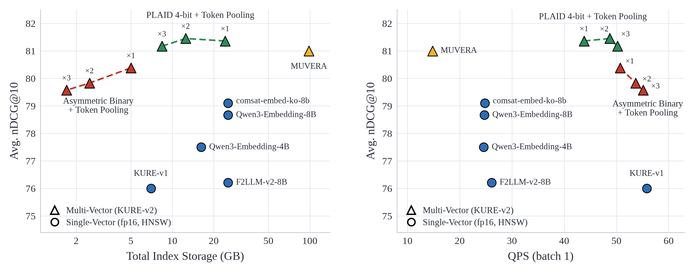
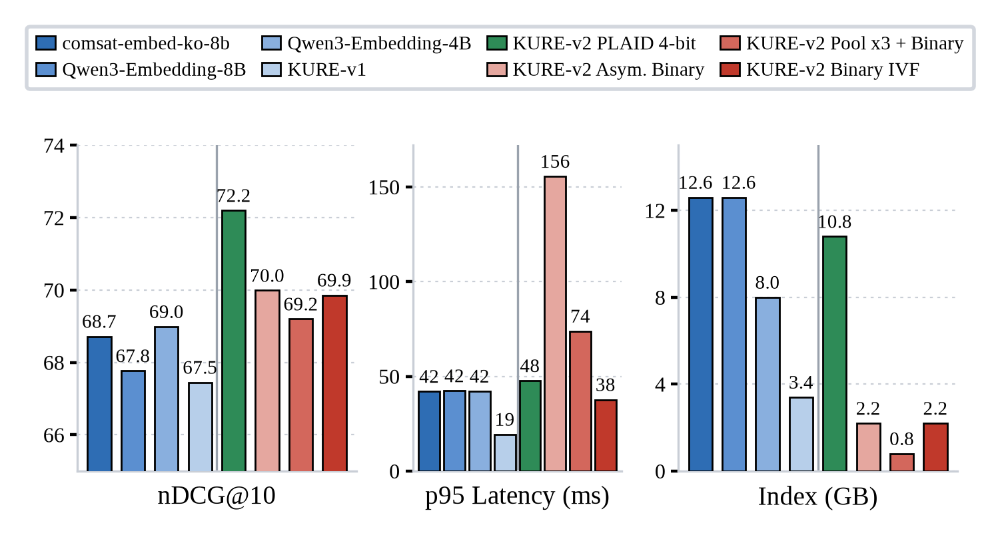

# Serving KURE-v2

[English](README.md) | [한국어](README_ko.md)

Runnable versions of the serving configurations benchmarked in the [KURE-v2 model card](https://huggingface.co/nlpai-lab/KURE-v2): encode a Korean retrieval dataset, build an index, and get quality + latency + index size in one command.

```
run.py      end-to-end experiment (encode -> build -> search -> report)
indexes.py  the index backends (exact MaxSim, PLAID, asymmetric binary, binary IVF)
```

## Benchmark results

KURE-v2 is a late-interaction model: each document is stored as a set of token vectors, so the practical questions for deployment are index size and search cost. We benchmarked KURE-v2 across ANN backends and compression schemes on the 9 Korean MTEB retrieval tasks, against five single-vector baselines served with [faiss HNSW](https://faiss.ai/cpp_api/struct/structfaiss_1_1IndexHNSW.html). All numbers are end-to-end: batch-1 query encoding + index search, measured serially on one A100 80GB.

<p align="center">
  
</p>

Two things the figures show:

- Hierarchical token pooling (x2) halves the index (24.2 -> 12.5 GB) with no measurable nDCG loss. Asymmetric binary quantization (1-bit document tokens, bf16 queries) shrinks it 4.8x for 0.98. Stacking the two (pooling x3 + binary), the entire 9-corpus index fits in **1.7 GB, smaller than every single-vector HNSW index (7.0-25.4 GB, fp16 vectors)**, while still outscoring the best single-vector model.
- A live query arrives as text: 4B-8B single-vector models spend 38-40 ms encoding it, capping them at ~25 QPS no matter how fast HNSW is. KURE-v2 encodes in 13.8 ms (154M params), so every configuration except MUVERA serves **44-57 QPS, roughly 2x the 8B single-vector models, at higher quality**.

### Large corpora: tail latency

<p align="center">
  
</p>

On the largest corpus (MIRACL, ~1.5M documents) an exhaustive 1-bit scan costs O(corpus): p95 climbs to 156 ms, and pooling the tokens 3x only brings it to 74 ms. Generating candidates with faiss [BinaryIVF](https://faiss.ai/cpp_api/struct/structfaiss_1_1IndexBinaryIVF.html) (Hamming search over the same 1-bit index) and re-scoring them with exact asymmetric MaxSim cuts p95 to **38 ms on the same 2.2 GB index, lower tail latency than the 4B-8B single-vector baselines (42 ms) at higher nDCG**. For large collections, use a candidate-generating index (PLAID or BinaryIVF), not an exhaustive scan.

<details>
<summary><b>Measurement details</b></summary>

- **Hardware**: 1x NVIDIA A100 80GB, 2x AMD EPYC 7513 (64 cores), 1.2 TB RAM.
- **Software**: faiss-cpu 1.15.0, fast-plaid 1.6.0, sentence-transformers 6.0.0, PyTorch 2.8.0.
- **Protocol**: batch-1, serial. Index-search latency: 10 warmup queries, then every query of the task measured once (QPS = 1/mean). Query-encoding latency: 5 warmup, 50 measured. End-to-end = encoding + search.
- **Precision**: encoding in bf16; each index stores its own format (HNSW fp16 vectors, PLAID 4-bit residuals, binary 1-bit).
- **Index size**: the full serialized index on disk (vectors, graph, codebooks; external doc-id mapping excluded). PLAID indexes are frozen (fast-plaid `freeze()`): the merged search-time codes/residuals only, without the per-shard build copies or the raw embeddings fast-plaid keeps for corpora of <= 1,000 documents.
- **Tasks**: the 9 Korean MTEB retrieval tasks; MLDR is the mean of its dev/test splits; nDCG@10 x100.
- **HNSW**: `IndexHNSWSQ` with fp16-stored vectors (inner product on L2-normalized embeddings; lossless for the bf16 embeddings), M=32, efConstruction=200, efSearch=64.
- **PLAID**: nbits=4, all other settings fast-plaid defaults (kmeans_niters=4, n_ivf_probe=8, n_full_scores=4096). nbits=2/1 give 14.2/9.1 GB at 81.40/80.70 nDCG.
- **MUVERA**: num_repetitions=10, num_simhash_projections=6, final_projection_dimension=8192, exact-MaxSim rerank of the top 1,000.
- **BinaryIVF**: nlist=floor(sqrt(total tokens)) capped at 65,536, nprobe=32, top-128 Hamming tokens per query token, exact asymmetric-MaxSim rerank of the top 1,000 documents.
- **Token pooling**: hierarchical (Ward linkage), pool_factor 2-3, documents only.
</details>

## Run

No setup: the `# /// script` block at the top of `run.py` declares its own dependencies (sentence-transformers >= 6.0, fast-plaid, faiss-cpu, torch 2.8/cu128), so `uv run deploy/late-interaction/run.py` ignores the project venv and resolves an isolated, cached environment for the script on first run. This is deliberate: the `late-interaction` extra pins pylate, which pins fast-plaid to the 1.4.6.x line, while the script pins the exact stack behind the model-card figures (sentence-transformers 6.0.0, fast-plaid 1.6.0, faiss-cpu 1.15.0, torch 2.8.0, and the flash-maxsim Triton kernel used for exhaustive and rerank MaxSim scoring; plain torch is the CPU fallback). The measurement protocol also matches: 10 warmup queries then every task query timed once for search, 5 warmup runs then 50 timed runs for batch-1 query encoding.

```bash
uv run deploy/late-interaction/run.py --index maxsim                     # exact MaxSim (quality ceiling)
uv run deploy/late-interaction/run.py --index plaid --nbits 4            # PLAID, n-bit residuals
uv run deploy/late-interaction/run.py --index plaid --nbits 4 --pool 3   # PLAID + token pooling x3
uv run deploy/late-interaction/run.py --index binary                     # asymmetric binary, exhaustive
uv run deploy/late-interaction/run.py --index binary --pool 3            # token pooling x3 + binary
uv run deploy/late-interaction/run.py --index plaid-binary               # PLAID candidates + binary rerank
uv run deploy/late-interaction/run.py --index plaid-binary --pool 3      # PLAID + pooling x3 + binary
uv run deploy/late-interaction/run.py --index binary-ivf                 # binary IVF + exact rerank
```

Each run prints nDCG@10, index size and build time, batch-1 query-encode and search latency (mean / p95), and the end-to-end QPS of the serial encode + search pipeline:

```
=== nlpai-lab/KURE-v2 | plaid | yjoonjang/markers_bm (720 docs, 714 queries) ===
nDCG@10:            0.96xx
index size:          xx.x MB (build x.xs)
query encode (bs=1): xx.x ms mean / xx.x ms p95
index search (bs=1): xx.x ms mean / xx.x ms p95
end-to-end:          xx.x QPS, xx.x ms p95
```

It also appends the same numbers as one JSON line to `results/<task>.jsonl` next to the script (config, dataset size, quality, latency, device), so repeated runs accumulate into a comparable log; `results/` in the repo holds reference runs of every backend on the Korean MTEB retrieval tasks, measured on one otherwise-idle A100 80GB. `--out <path>` redirects, `--out none` skips.

## Backends

| `--index` | What it does | Trade-off |
|---|---|---|
| `maxsim` | Exhaustive exact MaxSim over bf16 token vectors | Quality ceiling; largest index, slowest at scale |
| `plaid` | PLAID (fast-plaid): centroid + 4-bit residual codes, centroid-driven candidate generation | ~3x smaller than the bf16 token vectors, near-exact quality |
| `binary` | Asymmetric binary quantization: documents keep 1 sign bit per dimension, queries stay full precision, scoring is the exact query x {-1,+1} dot | 32x smaller than fp32; exhaustive scan |
| `plaid-binary` | Two-stage: PLAID (from the original vectors) retrieves `--rerank-depth` candidates, re-scored with the exact asymmetric binary MaxSim | Binary-quality results without the exhaustive scan; stores PLAID index + 1-bit codes |
| `binary-ivf` | Same 1-bit codes; candidates via faiss binary IVF (Hamming over inverted lists), top candidates re-scored with the exact asymmetric MaxSim | Binary-level size with sublinear search; the query is never quantized in the score that ranks the output |

`--pool N` applies hierarchical token pooling at document-encode time (clusters each document's tokens and averages within clusters, shrinking every index ~Nx); it composes with any backend. Queries are never pooled.

## Options

- `--task`: any Korean MTEB retrieval task (default `AutoRAGRetrieval`, small enough for a quick pass); loads via mteb with the Korean subset. `--split` picks a non-default eval split (e.g. MLDR dev/test).
- `--dataset`: alternatively, any BeIR-style HF dataset with `corpus` / `queries` / `default` (qrels) configs; overrides `--task`.
- `--limit N`: cap corpus and query count for a smoke run (e.g. `--limit 100` on CPU).
- `--device`: defaults to cuda when available. GPU is strongly recommended for encoding.
- Backend knobs use the benchmark defaults: `--nbits 4` (PLAID), `--nprobe 32`, `--topk-tokens 128`, `--rerank-depth 1000` (binary IVF).

## Relation to the model card numbers

The model card's Serving section reports the same configurations measured under a fixed protocol (9 Korean MTEB retrieval tasks, single A100 80GB, batch-1 serial encode + search, warmup + repeated timed queries). This directory reproduces the mechanics with a lighter protocol on one dataset, so expect the same ordering between methods rather than identical numbers. One caveat at demo scale: on a corpus this small (720 documents) PLAID's per-call overhead dominates, so it is slower than the exhaustive scans here even though its index is already ~3x smaller; its speed advantage appears on large corpora (see the model card's MIRACL figures). Reported index sizes are the servable index only: PLAID indexes are frozen after build (`freeze()`, `start_from_scratch=0`), which drops fast-plaid's per-shard build copies and the raw embeddings it otherwise keeps for corpora of <= 1,000 documents.
